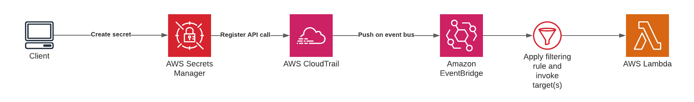

# Monitor Secrets Manager lifecycle events using AWS EventBridge

## Here are couple things that were not covered in the orignal README by Sunny Wang. 

- To install AWS CDK, run the following command in your terminal: `npm install -g aws-cdk`.
- Use `npm install` to install all required npm packages. 
- Look like you have to install and start docker daemon first. Otherwise, it would error "Cannot connect to the Docker daemon at unix:///var/run/docker.sock. Is the docker daemon running?", when running `cdk deploy`. 
- Use `cdk bootstrap` to boostrap cdk. It will create a CDKToolkit stack in cloudformation. 
- Use ` cdk deploy` to deploy cdk. It will create a new stack in cloudformation for the secrets manager lifecycle stack, that is, SecretsManagerLifecycleExampleStack. 

## Goal

Plug into Secrets Manager lifecycle events using AWS CloudTrail and AWS EventBridge

## Architecture

## Solution

Leverage AWS EventBridge using CloudTrail to filtering on Secret Manager lifecycle events.

## Project structure

- `scripts`: Contains 2 small `zx` helper scripts to perform an operation in Secrets Manager.
- `infra`: Contains a AWS CDK project containing the infrastructure for the solution.

## Setup

- `cdk deploy` in the `infra` folder to deploy the infrastructure.
- `npx zx scripts/secrets-manager-create-lifecycle-event.mjs` to create a secret. This will create an event that will be picked up by the rule configured in the infrastructure
- `npx zx scripts/secrets-manager-delete-lifecycle-event.mjs` to delete a secret. This will create an event that will be picked up by the rule configured in the infrastructure
